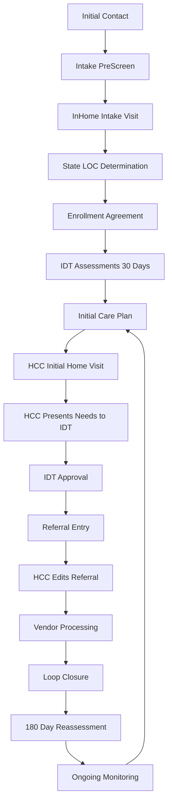

```mermaid
flowchart TD
A[Initial Contact] --> B[Intake PreScreen]
B --> C[InHome Intake Visit]
C --> D[State LOC Determination]
D --> E[Enrollment Agreement]
E --> F[IDT Assessments 30 Days]
F --> G[Initial Care Plan]
G --> H[HCC Initial Home Visit]
H --> I[HCC Presents Needs to IDT]
I --> J[IDT Approval]
J --> K[Referral Entry]
K --> L[HCC Edits Referral]
L --> M[Vendor Processing]
M --> N[Loop Closure]
N --> O[180 Day Reassessment]
O --> P[Ongoing Monitoring]
P --> G
```
